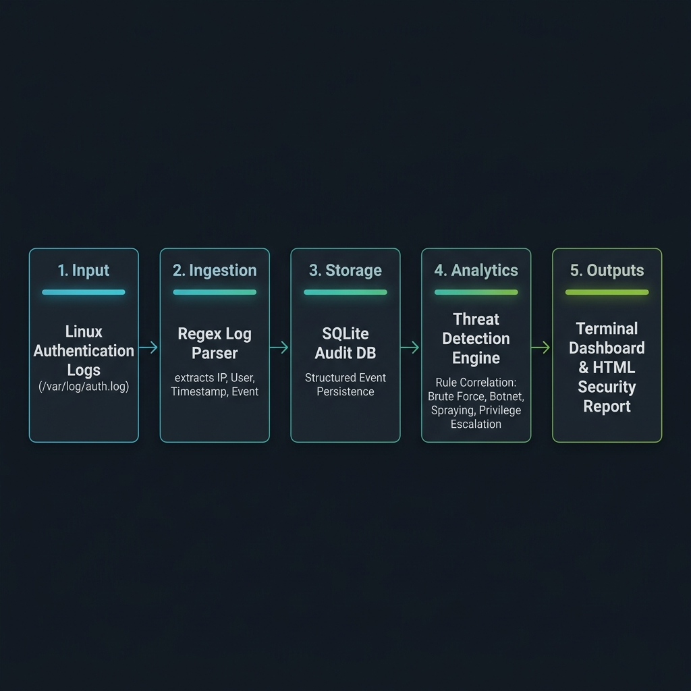

# 🛡️ Warden — Linux Security Log Analytics & Threat Detection

> A lightweight Python security engine for parsing Linux authentication logs (`/var/log/auth.log`), detecting security threats using rule-based correlation logic, persisting audit events into SQLite, and generating self-contained HTML audit reports.

---

## 🌟 Overview

**Warden** automatically ingests Linux authentication logs and identifies sophisticated attack vectors including:
- **SSH Brute-Force Attacks** (high-frequency single-source login attempts)
- **Distributed Botnet Attacks** (multi-IP targeted login attempts against single accounts)
- **Password Spray Attacks** (single IP targeting multiple user accounts to bypass lockout policies)
- **Credential Compromise** (failed authentication attempts followed by successful login)
- **Direct Root Targeting** (attempts against high-privilege accounts)
- **Unauthorized Account Creation** (`useradd` / `adduser` tracking)
- **Privilege Escalation** (`sudo` command execution auditing)

---

## 🏗️ Architecture & Pipeline



```
/var/log/auth.log (or custom log)
        │
        ▼
[1. Log Parser] (Regex pattern matching across syslog signatures)
        │
        ▼
[2. SQLite Database] (Structured event storage & audit log persistence)
        │
        ▼
[3. Threat Analyzer] (7 Rule-based detection modules)
        │
        ▼
 ┌──────┴────────────────────────┐
 ▼                               ▼
[Terminal Dashboard]     [HTML Audit Report]
(Rich CLI formatting)    (Self-contained dark theme report)
```

---

## 🚀 Quickstart & Usage

### Prerequisites
Warden requires **Python 3.10+** and the `rich` CLI library:

```bash
pip install rich
```

### 1. Run in Demo Mode (Synthetic Log Generator)
Test Warden instantly without root access:

```bash
python3 warden.py --demo
```
This generates a synthetic `demo_auth.log` containing attack scenarios and creates `warden_report.html`.

### 2. Run on Live Linux System Logs
Analyze live Linux authentication logs (`/var/log/auth.log`):

```bash
sudo python3 warden.py
```

### 3. Custom Log File or Custom Report Path
```bash
python3 warden.py --log /path/to/custom_auth.log --report /path/to/output_report.html
```

---

## 🔍 Detection Modules

| Module | Detection Logic | Severity |
|---|---|---|
| **Brute Force** | Single IP making $\ge 5$ failed login attempts | MEDIUM / HIGH / CRITICAL |
| **Distributed Attack** | Single username targeted by $\ge 10$ failures across $\ge 3$ unique IPs | MEDIUM / HIGH / CRITICAL |
| **Password Spray** | Single IP attempting login against $\ge 5$ unique usernames | MEDIUM / HIGH |
| **Credential Compromise** | Source IP with $\ge 3$ failures followed by a successful login | CRITICAL |
| **Root Targeting** | Failed authentication attempts against user `root` | HIGH |
| **New User Creation** | Logging of `useradd` or `adduser` execution | MEDIUM |
| **Sudo Execution** | Logging of `sudo` command executions | LOW |

---

## 🗄️ Database Schema

All parsed events are stored in `warden.db` (`events` table):

```sql
CREATE TABLE events (
    id          INTEGER PRIMARY KEY AUTOINCREMENT,
    timestamp   TEXT,      -- Event timestamp
    event_type  TEXT,      -- e.g. 'failed_login', 'accepted_login', 'sudo_command'
    user        TEXT,      -- Target username
    ip          TEXT,      -- Source IP address
    port        TEXT,      -- Source port
    command     TEXT,      -- Sudo command string (if applicable)
    raw         TEXT       -- Original raw log entry for forensic audit
);
```

---

## 📊 Deliverables & Output

Warden generates a self-contained HTML report (`warden_report.html`) featuring:
- **Executive Risk Summary**: Risk score and threat counter banner.
- **Threat Event Analysis**: Detailed cards for each flagged threat.
- **Attacker Analysis**: Top offending IPs and targeted account names.
- **Privilege Escalation Audit**: Complete history of `sudo` command executions.

---

## 🛠️ Technology Stack

- **Language**: Python 3.10+
- **Parsing**: Regular Expressions (`re` stdlib)
- **Database**: SQLite (`sqlite3` stdlib)
- **CLI Dashboard**: `rich`
- **Output**: Self-contained HTML5/CSS3

---

## 📄 License
Distributed under the MIT License.
